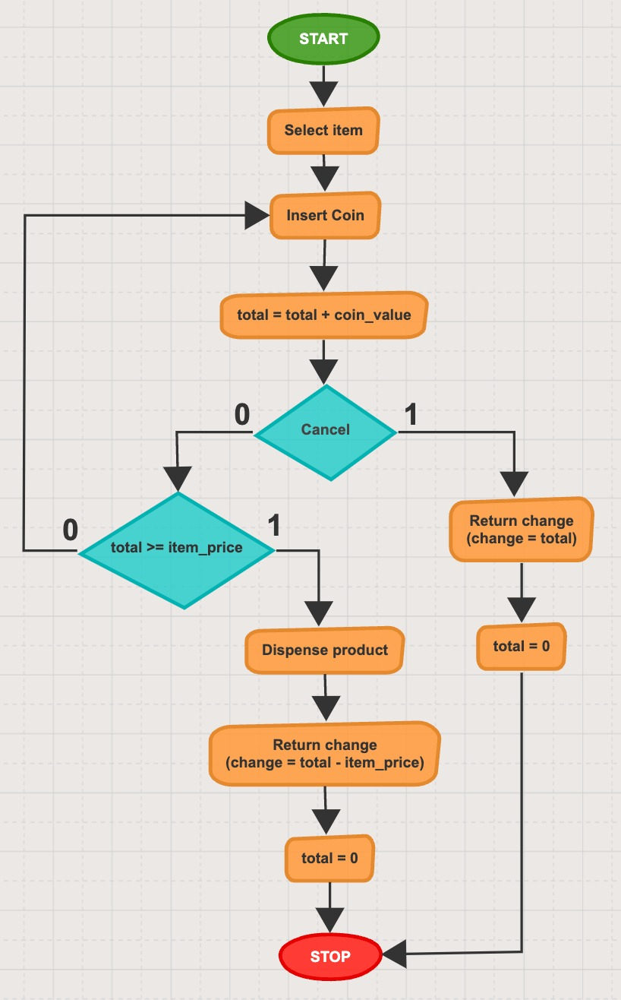
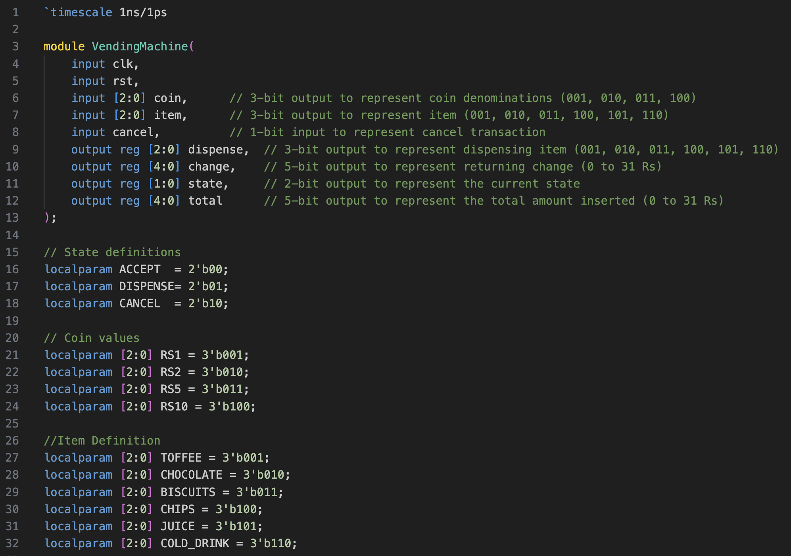
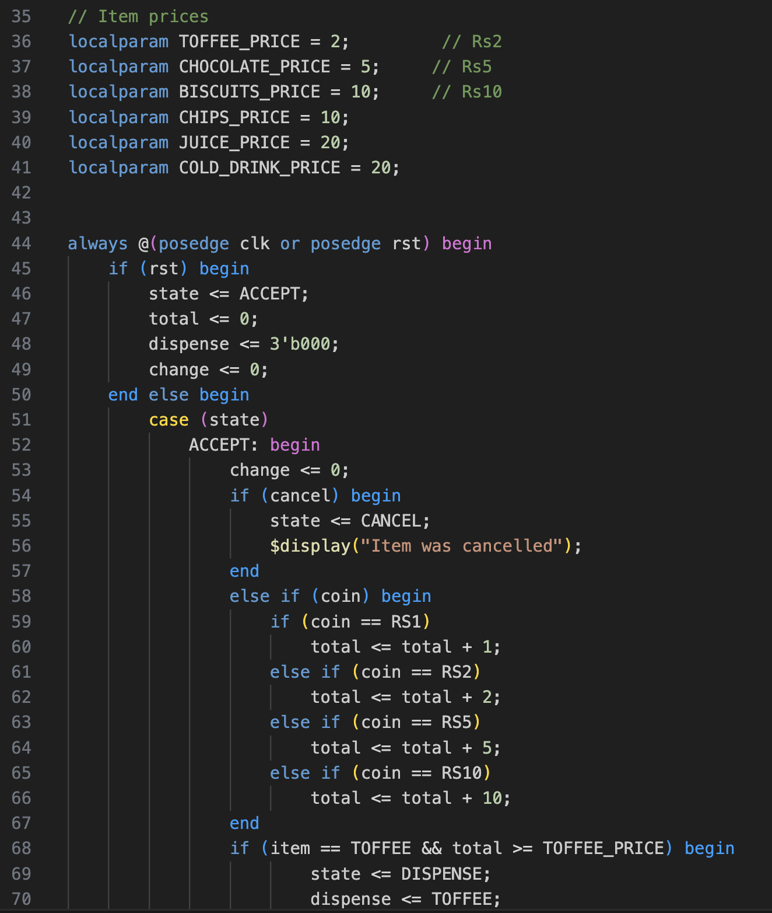
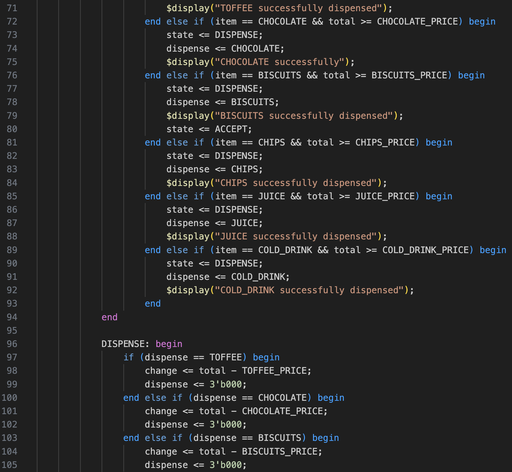
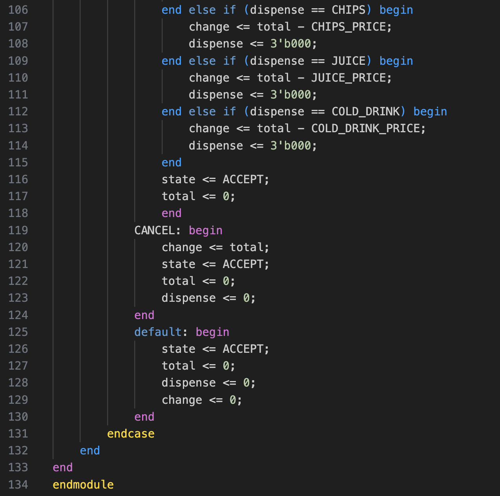
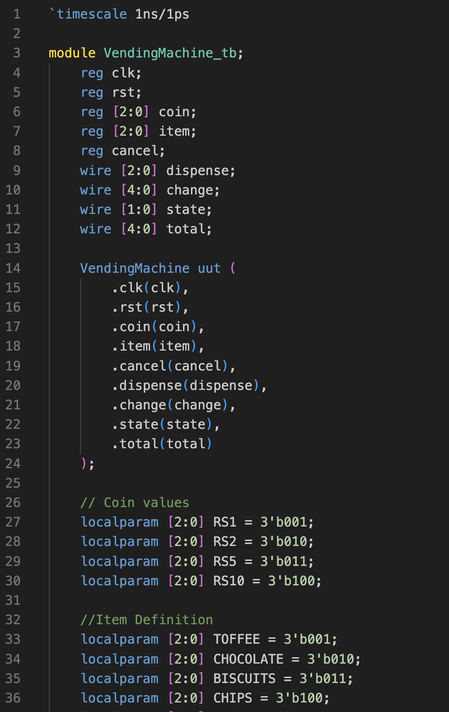
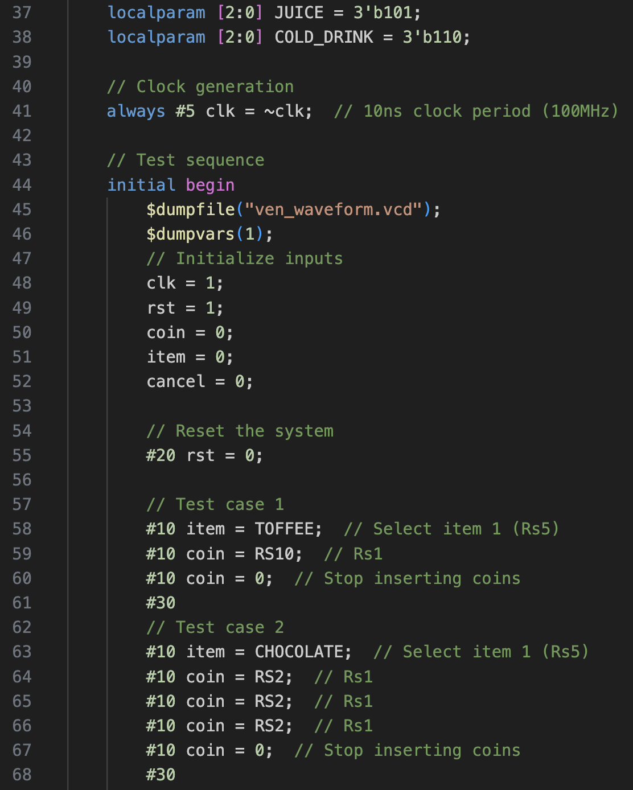
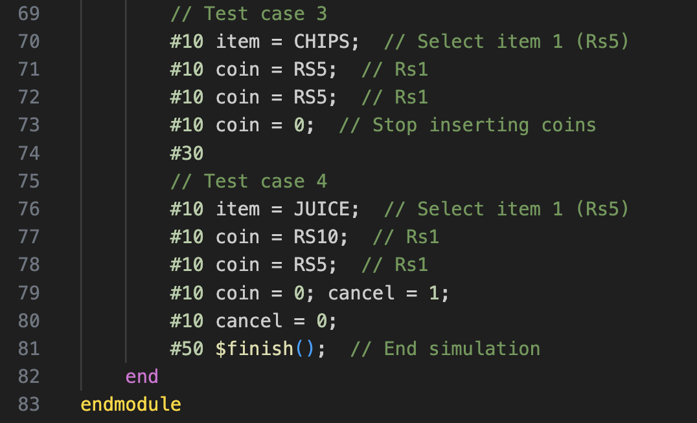
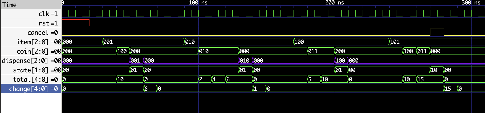

# ASM Vending Machine
I developed a vending machine using an Algorithmic State Machine (ASM) in Verilog, incorporating features such as a cancel option and the ability to return change.

## Specifications

The products available in the vending machine are priced as follows:
1. Toffee -> Rs 2
2. Chocolate -> Rs 5
3. Biscuit -> Rs 10
4. Chips -> Rs 10
5. Juice -> Rs 20
6. Cold Drink -> 20

User can insert the following coin denominations:
1. Rs1 coin
2. Rs 2 coin
3. Rs 5 coin
4. Rs 10 coin

There is a feature of cancel button, which will abort the transaction and any inserted money is returned to the user.

The return change feature in the vending machine ensures that any excess amount inserted by the user, beyond the cost of the selected item

## Algorithmic State Machine Chart

The vending machine process works as follows: 
First, the user selects an item and inserts a coin. 
The machine then adds the coin's value to the total amount. 
If the cancel button is pressed, the transaction is aborted, and the change is returned. 
If cancel is not pressed, the machine checks if the total amount is greater than the item's price.  If not, more coins need to be inserted. If the total exceeds the item's price, the machine dispenses the item, returns the change, and concludes the transaction.

## Verilog Design Code

## Testbench

## Waveform

